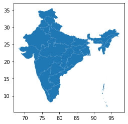
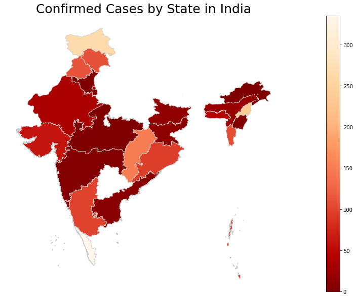

## <b>Statewise Data Analysis of COVID-19</b>

The Data is provided by <a href="https://github.com/HrithikMittal/COVID19-India-API">Adhikansh Mittal's API</a> and the shapefiles are provided by <a href = "https://www.arcgis.com/home/user.html?user=planner_vijay_meena">Vijay Meena</a>. It provides a statewise visualisation of deaths. <br><br>
Geopandas on Windows using ```pip install geopandas``` might not work. You can follow <a href = "https://stackoverflow.com/questions/34427788/how-to-successfully-install-pyproj-and-geopandas">this</a> to sort that out. Since we are running on colab, it is not much of an issue, you can right away install it using ```pip install geopandas```.


```python
pip install geopandas
```

    Requirement already satisfied: geopandas in /usr/local/lib/python3.6/dist-packages (0.7.0)
    Requirement already satisfied: shapely in /usr/local/lib/python3.6/dist-packages (from geopandas) (1.7.0)
    Requirement already satisfied: pyproj>=2.2.0 in /usr/local/lib/python3.6/dist-packages (from geopandas) (2.6.0)
    Requirement already satisfied: pandas>=0.23.0 in /usr/local/lib/python3.6/dist-packages (from geopandas) (1.0.3)
    Requirement already satisfied: fiona in /usr/local/lib/python3.6/dist-packages (from geopandas) (1.8.13.post1)
    Requirement already satisfied: numpy>=1.13.3 in /usr/local/lib/python3.6/dist-packages (from pandas>=0.23.0->geopandas) (1.18.2)
    Requirement already satisfied: pytz>=2017.2 in /usr/local/lib/python3.6/dist-packages (from pandas>=0.23.0->geopandas) (2018.9)
    Requirement already satisfied: python-dateutil>=2.6.1 in /usr/local/lib/python3.6/dist-packages (from pandas>=0.23.0->geopandas) (2.8.1)
    Requirement already satisfied: cligj>=0.5 in /usr/local/lib/python3.6/dist-packages (from fiona->geopandas) (0.5.0)
    Requirement already satisfied: six>=1.7 in /usr/local/lib/python3.6/dist-packages (from fiona->geopandas) (1.12.0)
    Requirement already satisfied: attrs>=17 in /usr/local/lib/python3.6/dist-packages (from fiona->geopandas) (19.3.0)
    Requirement already satisfied: click<8,>=4.0 in /usr/local/lib/python3.6/dist-packages (from fiona->geopandas) (7.1.1)
    Requirement already satisfied: munch in /usr/local/lib/python3.6/dist-packages (from fiona->geopandas) (2.5.0)
    Requirement already satisfied: click-plugins>=1.0 in /usr/local/lib/python3.6/dist-packages (from fiona->geopandas) (1.1.1)
    


```python
pip install requests
```

    Requirement already satisfied: requests in /usr/local/lib/python3.6/dist-packages (2.21.0)
    Requirement already satisfied: certifi>=2017.4.17 in /usr/local/lib/python3.6/dist-packages (from requests) (2019.11.28)
    Requirement already satisfied: idna<2.9,>=2.5 in /usr/local/lib/python3.6/dist-packages (from requests) (2.8)
    Requirement already satisfied: chardet<3.1.0,>=3.0.2 in /usr/local/lib/python3.6/dist-packages (from requests) (3.0.4)
    Requirement already satisfied: urllib3<1.25,>=1.21.1 in /usr/local/lib/python3.6/dist-packages (from requests) (1.24.3)
    


```python
pip install pandas
```

    Requirement already satisfied: pandas in /usr/local/lib/python3.6/dist-packages (1.0.3)
    Requirement already satisfied: pytz>=2017.2 in /usr/local/lib/python3.6/dist-packages (from pandas) (2018.9)
    Requirement already satisfied: python-dateutil>=2.6.1 in /usr/local/lib/python3.6/dist-packages (from pandas) (2.8.1)
    Requirement already satisfied: numpy>=1.13.3 in /usr/local/lib/python3.6/dist-packages (from pandas) (1.18.2)
    Requirement already satisfied: six>=1.5 in /usr/local/lib/python3.6/dist-packages (from python-dateutil>=2.6.1->pandas) (1.12.0)
    


```python
pip install matplotlib
```

    Requirement already satisfied: matplotlib in /usr/local/lib/python3.6/dist-packages (3.2.1)
    Requirement already satisfied: python-dateutil>=2.1 in /usr/local/lib/python3.6/dist-packages (from matplotlib) (2.8.1)
    Requirement already satisfied: pyparsing!=2.0.4,!=2.1.2,!=2.1.6,>=2.0.1 in /usr/local/lib/python3.6/dist-packages (from matplotlib) (2.4.6)
    Requirement already satisfied: kiwisolver>=1.0.1 in /usr/local/lib/python3.6/dist-packages (from matplotlib) (1.1.0)
    Requirement already satisfied: cycler>=0.10 in /usr/local/lib/python3.6/dist-packages (from matplotlib) (0.10.0)
    Requirement already satisfied: numpy>=1.11 in /usr/local/lib/python3.6/dist-packages (from matplotlib) (1.18.2)
    Requirement already satisfied: six>=1.5 in /usr/local/lib/python3.6/dist-packages (from python-dateutil>=2.1->matplotlib) (1.12.0)
    Requirement already satisfied: setuptools in /usr/local/lib/python3.6/dist-packages (from kiwisolver>=1.0.1->matplotlib) (46.0.0)
    


```python
import requests
import geopandas as pd
import pandas as pd
import matplotlib.pyplot as plt
import json
```


```python
url = "https://covid19-india-adhikansh.herokuapp.com/states"
response = requests.get(url)
response = response.json()
response = dict(response)
response = response["state"]
confirmed = []
for i in range(len(response)):
  del response[i]['_id']
  del response[i]['total']
  confirmed.append(response[i]['confirmed'])
#prettyPrintJSON = json.dumps(response, indent=2)
#print(prettyPrintJSON)
df = pd.DataFrame.from_dict(response)
print(df)
```

                               name  confirmed  cured  death
    0                Andhra Pradesh         86      1      1
    1   Andaman and Nicobar Islands         10      0      0
    2                         Assam          1      0      0
    3                         Bihar         23      0      1
    4                    Chandigarh         16      0      0
    5                  Chhattisgarh          9      2      0
    6                         Delhi        152      6      2
    7                           Goa          5      0      0
    8                       Gujarat         82      5      6
    9                       Haryana         43     21      0
    10             Himachal Pradesh          3      1      1
    11            Jammu and Kashmir         62      2      2
    12                    Jharkhand          1      0      0
    13                    Karnataka        110      9      3
    14                       Kerala        265     25      2
    15                       Ladakh         13      3      0
    16               Madhya Pradesh         99      0      6
    17                  Maharashtra        335     42     13
    18                      Manipur          1      0      0
    19                      Mizoram          1      0      0
    20                       Odisha          4      0      0
    21                   Puducherry          3      1      0
    22                       Punjab         46      1      4
    23                    Rajasthan        108      3      0
    24                   Tamil Nadu        234      6      1
    25                    Telengana         96      1      3
    26                  Uttarakhand          7      2      0
    27                Uttar Pradesh        113     14      2
    28                  West Bengal         37      6      3
    

Now that we have fetched the API and stored it in a variable, our next job is to fetch a SHX file and plot it via GeoPandas. To do this, you have to fetch your SHX file. You can download them for your country from <a href = "https://www.diva-gis.org/gdata">DIVA-GIS</a> (https://www.diva-gis.org/gdata).<br> 
If you are on colab, look to your left, there should be a hamburger icon. Click on it, and click on files (or file icon), and upload your .SHX there.


```python
fp = "IND_adm1.shx"
map_df = gpd.read_file(fp)
map_df.plot()
print(map_df)
```

                                                 geometry
    0   MULTIPOLYGON (((93.78773 6.85264, 93.78849 6.8...
    1   MULTIPOLYGON (((80.27458 13.45958, 80.27458 13...
    2   POLYGON ((96.15778 29.38310, 96.16380 29.37668...
    3   MULTIPOLYGON (((89.87145 25.53730, 89.87118 25...
    4   MULTIPOLYGON (((88.10548 26.53904, 88.10505 26...
    5   POLYGON ((76.80293 30.67548, 76.79437 30.66932...
    6   POLYGON ((83.32760 24.09965, 83.34575 24.09707...
    7   POLYGON ((73.02468 20.09630, 73.01955 20.10502...
    8   MULTIPOLYGON (((72.86014 20.47096, 72.86340 20...
    9   POLYGON ((77.32713 28.68516, 77.32539 28.68250...
    10  MULTIPOLYGON (((73.78181 15.35569, 73.78181 15...
    11  MULTIPOLYGON (((70.86097 20.75292, 70.86097 20...
    12  POLYGON ((76.83715 30.87887, 76.85243 30.87069...
    13  POLYGON ((76.80276 33.23666, 76.80630 33.23623...
    14  POLYGON ((77.89957 35.42789, 77.90297 35.42759...
    15  POLYGON ((87.59989 25.31466, 87.60688 25.31138...
    16  MULTIPOLYGON (((74.67097 13.19986, 74.67097 13...
    17  MULTIPOLYGON (((76.46736 9.54097, 76.46736 9.5...
    18  MULTIPOLYGON (((73.01014 8.28042, 73.01014 8.2...
    19  POLYGON ((78.36465 26.86884, 78.36688 26.86259...
    20  MULTIPOLYGON (((73.45597 15.88986, 73.45597 15...
    21  POLYGON ((94.57723 25.64833, 94.57609 25.64470...
    22  POLYGON ((91.85384 26.10479, 91.86470 26.10035...
    23  POLYGON ((92.80080 24.41905, 92.80370 24.41879...
    24  POLYGON ((95.21445 26.93695, 95.21706 26.93420...
    25  MULTIPOLYGON (((84.76986 19.10597, 84.76986 19...
    26  MULTIPOLYGON (((79.84486 10.82653, 79.84486 10...
    27  POLYGON ((75.86877 32.48868, 75.88712 32.47203...
    28  POLYGON ((73.88944 29.97761, 73.89118 29.97007...
    29  POLYGON ((88.64526 28.09912, 88.65411 28.08984...
    30  MULTIPOLYGON (((77.55596 8.07903, 77.55596 8.0...
    31  POLYGON ((78.33625 19.88319, 78.34669 19.88140...
    32  POLYGON ((92.18520 24.52287, 92.18896 24.52019...
    33  POLYGON ((77.58468 30.40878, 77.58639 30.40801...
    34  POLYGON ((79.19478 31.35362, 79.19817 31.35196...
    35  MULTIPOLYGON (((88.01861 21.57278, 88.01889 21...
    





```python
merged = map_df.join(df)
merged = merged.dropna()
merged = merged[['name', 'geometry', 'death', 'cured', 'confirmed']]
print(merged)
```

                               name  ... confirmed
    0                Andhra Pradesh  ...      86.0
    1   Andaman and Nicobar Islands  ...      10.0
    2                         Assam  ...       1.0
    3                         Bihar  ...      23.0
    4                    Chandigarh  ...      16.0
    5                  Chhattisgarh  ...       9.0
    6                         Delhi  ...     152.0
    7                           Goa  ...       5.0
    8                       Gujarat  ...      82.0
    9                       Haryana  ...      43.0
    10             Himachal Pradesh  ...       3.0
    11            Jammu and Kashmir  ...      62.0
    12                    Jharkhand  ...       1.0
    13                    Karnataka  ...     110.0
    14                       Kerala  ...     265.0
    15                       Ladakh  ...      13.0
    16               Madhya Pradesh  ...      99.0
    17                  Maharashtra  ...     335.0
    18                      Manipur  ...       1.0
    19                      Mizoram  ...       1.0
    20                       Odisha  ...       4.0
    21                   Puducherry  ...       3.0
    22                       Punjab  ...      46.0
    23                    Rajasthan  ...     108.0
    24                   Tamil Nadu  ...     234.0
    25                    Telengana  ...      96.0
    26                  Uttarakhand  ...       7.0
    27                Uttar Pradesh  ...     113.0
    28                  West Bengal  ...      37.0
    
    [29 rows x 5 columns]
    


```python
# set the value column that will be visualised
variable = 'confirmed'

# set the range for the choropleth values
vmin = 0
vmax = max(confirmed)

# create figure and axes for Matplotlib
fig, ax = plt.subplots(1, figsize=(30, 10))

# remove the axis
ax.axis('off')

# add a title and annotation
ax.set_title('Confirmed Cases by State in India', fontdict={'fontsize': '25', 'fontweight' : '3'})

# Create colorbar legend
sm = plt.cm.ScalarMappable(cmap='OrRd_r', norm=plt.Normalize(vmin=vmin, vmax=vmax))

# empty array for the data range
sm.set_array([]) # or alternatively sm._A = []. Not sure why this step is necessary, but many recommends it

# add the colorbar to the figure
fig.colorbar(sm)

# create map
merged.plot(column=variable, cmap='OrRd_r', linewidth=0.8, ax=ax, edgecolor='0.8')
```


    <matplotlib.axes._subplots.AxesSubplot at 0x7fde51e92ef0>





```python


```
